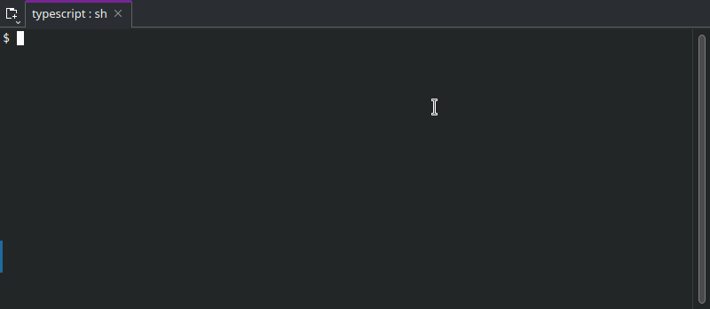

# Mimic

<p align="center">
  
</p>

Mimic is a CLI tool that allows you to easily create project templates (**mimic templates**) and clone them, prompting for variables and running hooks to generate your project (a **mimic**).

Mimic templates are primarily git-based (ie stored in a git repository), but they can also be stored in a local folder.

By using Mimic, you can automate repetitive tasks and save time by quickly generating new projects based on pre-defined templates. Instead of manually setting up your project structure or configurations each time, Mimic handles it for you, allowing you to focus on what matters.

However, it's important to note that Mimic is specifically designed for template purposes and not for generating dynamic code. While Mimic (will) supports conditional rendering in templates, it does not aim to provide the full code generation capabilities of tools like [Cookiecutter](https://github.com/cookiecutter/cookiecutter) or [Copier](https://github.com/copier-org/copier). If your goal is to generate or manipulate code within your templates, you may want to explore those other tools instead.

## [Features](#features)

* Clone a mimic template and prompt the user for template-defined variables for automatic template injection
* Run pre / post template injection commands via template-defined hooks
* Easily create new mimic templates with the help of the mimic linter and the mimic previewer
* Manage your mimic template with the mimic aliases wallet
* Works on Windows and Linux
* WIP: conditional rendering and conditional hook triggering

## Table of content

1. [Installation](#installation) 
    1. [Ubuntu, Debian](#ubuntu-debian)
    1. [Windows](#windows)
1. [Usage](#usage)
    1. [Creating a mimic template](#creating-a-mimic-template)
    1. [Variables](#variables)
        1. [Defining variables](#defining-variables)
        1. [Using variables](#using-variables)
        1. [Escaping variables](#escaping-variables)
        1. [Conditionnal rendering with variables](#conditionnal-rendering-with-variables)
        1. [More on variables](#more-on-variables)
    1. [Hooks](#hooks)
        1. [Defining an hook](#defining-an-hook)
        1. [More on hooks](#more-on-hooks)
    1. [Linter](#linter)
    1. [Previewing your project](#previewing-your-project)
    1. [Cloning a mimic template](#cloning-a-mimic-template)
    1. [Mimic aliases](#mimic-aliases)
        1. [Adding a mimic alias](#adding-a-mimic-alias)
        1. [Removing a mimic alias](#removing-a-mimic-alias)
        1. [Listing your mimic aliases](#listing-your-mimic-aliases)
        1. [Using a mimic alias](#using-a-mimic-alias)
        1. [Mimic aliases wallet](#mimic-aliases-wallet)
1. [Command line options](#command-line-options)
1. [.mimic.json schema references](#mimicjson-schema-references)
1. [Uninstall mimic](#uninstall-mimic)
    1. [Ubuntu, Debian](#uubuntu-debian)
    1. [Windows](#uwindows)
1. [Roadmap](#roadmap)

## [Installation](#installation)

### [Ubuntu, Debian](#ubuntu-debian)

Install git (if not already installed):
```bash
sudo apt update && sudo apt install git
```


Install Python (if not already installed):
```bash
sudo apt update && sudo apt install python3 python3-venv
```

Install mimic:
```bash
git clone https://github.com/LasramR/mimic.git ~/.mimic && ~/.mimic/scripts/install.sh
```

Open a new shell session and running `mimic -h` should output:
```bash
usage: mimic [-h] {clone,lint,alias,init,preview} ...

...
```

Tips:
* if you don't have sudo rights on your machine, you can install Python with [pyenv](https://github.com/pyenv/pyenv)


### [Windows](#windows)

Install git (if not already installed):
* download and install the latest release of Git for Windows [https://git-scm.com](https://git-scm.com/downloads/win)

Install Python (if not already installed):
* download and install the latest release of Python from [python.org](https://www.python.org/downloads/windows/)

Install mimic (through powershell):
```ps1
Set-ExecutionPolicy Bypass -scope Process -Force; git clone https://github.com/LasramR/mimic.git "$($env:USERPROFILE)\\.mimic"; powershell "$($env:USERPROFILE)\\.mimic\\scripts\\install.ps1";
```

Open a new powershell session and running `mimic -h` should output:
```bash
usage: mimic [-h] {clone,lint,alias,init,preview} ...

...
```

Tips:
* if you don't have admin privileges on your machine, you can install Python by:
  * running the installer
  * uncheck "Use admin privileges when installing py.exe"
  * check "Add python.exe to PATH"
  * click "Install Now"

## [Usage](#usage)

### [Creating a mimic template](#creating-a-mimic-template)

To create a mimic template, in the root folder of your template, run :

```bash
mimic init
```

This will create a file named `.mimic.json` in your current folder.

The `.mimic.json` file is the core of mimic, it is used to :
* define variables in your mimic template
* define hooks to trigger when generating a **mimic** (ie a folder structure that has been processed by the mimic CLI) from your mimic template
* integrate git in your mimic

See [Command line options](#command-line-options) for additional information about the `mimic init` command.

### [Variables](#variables)

A variable is a name defined in the `.mimic.json`. When generating a mimic from a template, the user will be prompted to indicate which value to associate with the variable. This value will be used by the mimic CLI to perform substitution of the variable name by the user input.

#### [Defining variables](#defining-variables)

In the `.mimic.json` file, add an object (`{ ... }`) property with the name of your variable in the "template"."variables" property. For example:

```jsonc
// .mimic.json
{
  "$schema": "https://raw.githubusercontent.com/LasramR/mimic/refs/heads/main/.mimic.0.5.0.schema.json",
  ...
  "template": {
    "variables": {
      "<Add your variable here>": {
        ...
      }
    }
  }
  ...
}
```

Then, set up its properties to define constraints on the user input (see [.mimic.json schema references](#mimicjson-schema-references)).

#### [Using variables](#using-variables)

A variable can be referenced in your mimic template using the mustache (``) syntax. You can reference your variables in :
* **file content**, insert variable values directly into file contents.
* **file name**, use variables to dynamically define file names.
* **directory name**, dynamically set directory names using variables.
* **hooks commands**, run dynamic commands by referencing variables in the hook "steps" property (see [Hooks](#hooks))

Examples:

* In file content:

```ts
// main.ts
const strToLog = "Hello {{ <Your variable> }}";
console.log(strToLog);
```

* In file name:

```
lib_{{ <Your variable> }}.ts
```

* In directory name:

```
src/lib/{{ <Your variable >}}/
```

* In hooks commands:

```jsonc
// .mimic.json
  "$schema": "https://raw.githubusercontent.com/LasramR/mimic/refs/heads/main/.mimic.0.5.0.schema.json",
  ...
  "hooks": [
    {
      "steps": [
        "echo \"{{ <Your variable> }}\"",
        ...
      ]
    }
  ]
  ...
```

#### [Escaping variables](#escaping-variables)

If for some reason, you actually need a mustache-like string in your template (eg a mustache template file), you can escape variables by mustaching the mustaches (`{{  }}`). For example:

```ts
// main.ts
const myMustacheTemplatedString = "Hello {{  }}"
console.log(myMustacheTemplatedString);
```

When processed by the mimic CLI (ie when cloning your mimic template), the file will contain:

```ts
// main.ts
const myMustacheTemplatedString = "Hello "
console.log(myMustacheTemplatedString);
```

You can automatically escape undefined variables using the mimic linter (see [Linter](#linter)).

#### [Conditionnal rendering with variables](#conditionnal-rendering-with-variables)

WIP

#### [More on variables](#more-on-variables)

* When cloning your mimic template, if the mimic CLI encounters an undefined variable, it will replace it with an empty string. You can detect dangling variables with the mimic linter (see [Linter](#linter)).

### [Hooks](#hooks)

A hook is a list of commands that will be triggered by the mimic CLI when cloning a mimic template. Hooks can be triggered at different times during the mimic cloning process (eg before replacing variables in your template, ...).

#### [Defining an hook](#defining-an-hook)

In the `.mimic.json` file, add an object (`{ ... }`) in the "hooks" array. For example:

```jsonc
// .mimic.json
{
  "$schema": "https://raw.githubusercontent.com/LasramR/mimic/refs/heads/main/.mimic.0.5.0.schema.json",
  ...
  "hooks": [
    { ... } // <- this is your new hook 
  ]
  ...
}
```

Then, set up its properties to define the hook behavior (see [.mimic.json schema references](#mimicjson-schema-references)).

#### [More on hooks](#more-on-hooks)

* By default, every command triggered by a hook will require user confirmation. If you want to bypass those confirmations you can the **-u**/**--unsafe** flag to your `mimic clone` command (see [Command line options](#command-line-options)).
* Hooks will run commands in a subshell, meaning that hooks can perform pretty bad actions on your machine. Be careful when cloning unknown mimic templates.

### [Linter](#linter)

The mimic linter is a tool for template creation. It can:
* check if your `.mimic.json` file is valid
* detect variables in your template that are not referenced in your `.mimic.json` file (ie variables that will be replaced by empty strings)
* detect variables in your `.mimic.json` file that are not used in your template (ie useless user inputs) 

To run the mimic linter on your mimic template, in the root folder of your template, run:

```bash
mimic lint
```

The mimic linter also come with a `--fix` arguments that allows you to automatically fix linting issues (if possible).

See [Command line options](#command-line-options) for additional information about the `mimic lint` command.

### [Previewing your project](#previewing-your-project)

The mimic CLI comes with a tool that allows you to preview what your cloned mimic template will look like. To preview your project, in the root folder of your template, run:

```bash
mimic preview
```

Then the mimic CLI will ask for your user inputs and display:
* directory names that will be renamed and their corresponding renamed version
* file names that will be renamed and their corresponding renamed version
* file content lines that will be replaced and their corresponding replaced version

See [Command line options](#command-line-options) for additional information about the `mimic preview` command.

### [Cloning a mimic template](#cloning-a-mimic-template)

Cloning a mimic template will create a mimic ((ie a folder structure that has been processed by the mimic CLI). To clone a mimic, run:

```bash
mimic clone <mimic template URI>
```

The \<mimic template URI> references a mimic template, this can either be:
* a git repository URL
* the path to a mimic template on your machine

When cloning a mimic template, the mimic CLI will:
* ask for user inputs
* run the "pre_template_injection" hooks
* process your template files by substituting variables with the corresponding user input
* run the "post_template_injection" hooks

See [Command line options](#command-line-options) for additional information about the `mimic clone` command.

### [Mimic aliases](#mimic-aliases)

Mimic aliases are short names that can be used with the `mimic clone` command to create mimics. Thus, mimic aliases are short names pointing to mimic template URIs.

#### [Adding a mimic alias](#adding-a-mimic-alias)

To add a mimic alias, run the following command:

```bash
mimic alias add <alias name> <mimic template URI>
```

The \<mimic template URI> references a mimic template, this can either be:
* a git repository URL
* the path to a mimic template on your machine

This will add an **unencrypted** entry in your mimic wallet (see [Mimic aliases wallet](#mimic-aliases-wallet)).

See [Command line options](#command-line-options) for additional information about the `mimic alias add` command.

#### [Removing a mimic alias](#removing-a-mimic-alias)

To remove a mimic alias, run the following command: 

```bash
mimic alias rm <alias name>
```

This will remove an entry from your mimic wallet (see [Mimic aliases wallet](#mimic-aliases-wallet)).

See [Command line options](#command-line-options) for additional information about the `mimic alias rm` command.

#### [Listing your mimic aliases](#listing-your-mimic-aliases)

To list your mimic aliases, run the following command: 

```
mimic alias list
```

This will list all entries from your mimic wallet (see [Mimic aliases wallet](#mimic-aliases-wallet)).

See [Command line options](#command-line-options) for additional information about the `mimic alias list` command.

#### [Using a mimic alias](#using-a-mimic-alias)

To use a mimic alias, when running the `mimic clone` command, instead of specifying the \<mimic template URI>, you can specify your mimic alias name. For example:

```bash
mimic clone my-alias
```

Will run the `mimic clone` command as usual. However, when looking for the \<mimic template URI>, the mimic CLI will search in your mimic aliases wallet (see [Mimic aliases wallet](#mimic-aliases-wallet)) and will try to find if (in this case) "my-alias" is defined.

If an alias is found, then mimic will clone the corresponding \<mimic template URI> of the alias.

See [Command line options](#command-line-options) for additional information about the `mimic clone` command.

#### [Mimic aliases wallet](#mimic-aliases-wallet)

A mimic alias wallet is a file used by the mimic CLI to store your aliases. By default, this file is located at `~/.mimic/wallet.mimic`, if not, run the following command to create one:

```bash
mimic alias init
```

This file contains all your mimic aliases in the following format:

```
...
<alias name> <mimic template URI>
...
```

Keep in mind that **nothing** is encrypted. Thus, if you decide to create an alias to a git repository URL that contains some kind of credentials (access token, user + password, ...), your alias and the git repository URL will be stored in **plain text** in the `wallet.mimic` file.

See [Command line options](#command-line-options) for additional information about the `mimic alias init` command.

## [Command line options](#command-line-options)

These are the command-line options available in Mimic. You can get detailed help for each command in your terminal by using the `-h` or `--help` flag with the corresponding command.

#### `mimic`
* **Description**: The mimic CLI
* **Usage**:
  ```bash
  mimic {clone,lint,alias,init,preview} ...
  ```

#### `mimic alias`
* **Description**: Manage your aliases, which are short names pointing to mimic templates.  
* **Usage**:  
  ```bash
  mimic alias {add,rm,list,init} ...
  ```
* `mimic alias add`  
  * **Description**: Add a new alias to your mimic wallet.  
  * **Usage**:  
    ```bash
    mimic alias add [-f FILE] alias mimic_uri
    ```
  * **Arguments**:  
    * `alias`  
      * **Type**: `str`  
      * **Description**: Alias name to add.  
    * `mimic_uri`  
      * **Type**: `str`  
      * **Description**: URI to the mimic template.  
    * `-f`, `--file`  
      * **Type**: `str` (optional)  
      * **Description**: Path to the mimic wallet to use.  
* `mimic alias init`  
  * **Description**: Create a new mimic wallet.  
  * **Usage**:  
    ```bash
    mimic alias init [file]
    ```
  * **Arguments**:  
    * `file`  
      * **Type**: `str` (optional)  
      * **Description**: Path to create a new mimic wallet, defaults to `~/.mimic/wallet.mimic`.  
* `mimic alias list`  
  * **Description**: List aliases from your mimic wallet.  
  * **Usage**:  
    ```bash
    mimic alias list [-f FILE]
    ```
  * **Arguments**:  
    * `-f`, `--file`  
      * **Type**: `str` (optional)  
      * **Description**: Path to the mimic wallet to use.  
* `mimic alias rm`  
  * **Description**: Remove an alias from your mimic wallet.  
  * **Usage**:  
    ```bash
    mimic alias rm [-f FILE] alias
    ```
  * **Arguments**:  
    * `alias`  
      * **Type**: `str`  
      * **Description**: Alias name to remove.  
    * `-f`, `--file`  
      * **Type**: `str` (optional)  
      * **Description**: Path to the mimic wallet to use.  

#### `mimic clone`
* **Description**: Clone and generate a mimic from a mimic template.  
* **Usage**:  
  ```bash
  mimic clone [-u] [-f FILE] mimic_uri [out_dir]
  ```
* **Arguments**:  
  * `mimic_uri`  
    * **Type**: `str`  
    * **Description**: URI to a mimic template (either a git repository or a path to a local mimic template).  
  * `out_dir`  
    * **Type**: `str` (optional)  
    * **Description**: The directory where the mimic template will be output.  
  * `-u`, `--unsafe`  
    * **Type**: `toggle`  
    * **Description**: Enable unsafe mode; hooks will run without user confirmation.  
  * `-f`, `--file`  
    * **Type**: `str` (optional)  
    * **Description**: Path to the mimic wallet to use for resolving aliases.  

#### `mimic init`
* **Description**: Setup a new mimic template.  
* **Usage**:  
  ```bash
  mimic init [mimic_template_dir]
  ```
* **Arguments**:  
  * `mimic_template_dir`  
    * **Type**: `str` (optional)  
    * **Description**: Path to the mimic template directory.  

#### `mimic lint`
* **Description**: Detect errors in your mimic template.  
* **Usage**:  
  ```bash
  mimic lint [--fix [{escape,clear}]] [mimic_template_dir]
  ```
* **Arguments**:  
  * `mimic_template_dir`  
    * **Type**: `str` (optional)  
    * **Description**: Path to the mimic template directory.  
  * `--fix`  
    * **Type**: `{escape,clear}` (defaults to `escape`)  
    * **Description**: Automatically fix mimic template issues by either escaping or clearing undefined variables.  

#### `mimic preview`
* **Description**: Preview your mimic template.  
* **Usage**:  
  ```bash
  mimic preview [mimic_template_dir]
  ```
* **Arguments**:  
  * `mimic_template_dir`  
    * **Type**: `str` (optional)  
    * **Description**: Path to the mimic template directory.

## [.mimic.json schema references](#mimicjson-schema-references)

The `.mimic.0.5.0.schema.json` provides a complete reference for the structure and properties of the `.mimic.json` configuration file. The `.mimic.json` is the core of mimic which define your mimic template and the behaviour of mimic CLI when cloning your template.

#### `$schema`
* **Description**: Specifies the schema file to validate against.  
* **Note**: This property **MUST** be set to `https://raw.githubusercontent.com/LasramR/mimic/refs/heads/main/.mimic.0.5.0.schema.json` for proper validation and autocompletion in your IDE.

#### `git`
* **Type**: `object`  
* **Description**: Configuration related to Git repository initialization.  
  * **Properties**:  
    * `enabled`:  
      * **Type**: `boolean`  
      * **Description**: Determines if Mimic should initialize a Git repository.  
      * **Required**: Yes  
    * `main_branch`:  
      * **Type**: `string`  
      * **Description**: Specifies the name of the main branch for the repository.  

#### `template`
* **Type**: `object`  
* **Description**: Defines the configuration for Mimic templates.  
  * **Properties**:  
    * `ignorePatterns`:  
      * **Type**: `array`  
      * **Description**: Lists of glob that will be ignored during mimic template cloning.  
      * **Items**:  
        * **Type**: `string`  
    * `variables`:  
      * **Type**: `object`  
      * **Description**: Contains named inputs prompted to users, substituted into files, paths, or commands.  
      * **Additional Properties**:  
        * Each variable is an object with the following properties:  
          * `description`:  
            * **Type**: `string`  
            * **Description**: A message displayed to users when prompting for input.  
          * `type`:  
            * **Type**: `string`  
            * **Description**: Constrains the type of user input.  
            * **Allowed Values**: `"string"`, `"number"`, `"boolean"`, `"regex"`, `"choice"`.  
          * `required`:  
            * **Type**: `boolean`  
            * **Description**: Indicates whether the variable must have a valid value.  
          * `default`:  
            * **Type** (conditional):
              * if `type` == `string`: `string`  
              * if `type` == `number`: `number`  
              * if `type` == `boolean`: `boolean`  
              * if `type` == `regex`: `string`  
              * if `type` == `choice`: `string`  
            * **Description**: Default value of the variable (Cannot be set if variable is required)  
          * `item` (conditional):  
            * if `type` == `regex`: A Python regex defining valid input values.  
            * if `type` == `choice`: A list of accepted values (minimum 1).
            * if `type` == `boolean`: Boolean format in templated files after processing (wether "Capitalized" or "lower", defaults to "lower")

#### `hooks`
* **Type**: `array`  
* **Description**: Defines scripts triggered at specific times during the execution of a Mimic template.  
* **Items**:  
  * **Type**: `object`  
  * **Item Properties**:  
    * `name`:  
      * **Type**: `string`  
      * **Description**: The name of the script.  
    * `when`:  
      * **Type**: `string`  
      * **Description**: Specifies when the script should run.  
      * **Allowed Values**: `"pre_template_injection"`, `"post_template_injection"`.  
    * `steps`:  
      * **Type**: `array`  
      * **Description**: A list of commands executed by the script. Must contain at least one command.  
    * `ignore_error`:  
      * **Type**: `boolean`  
      * **Description**: If `true`, execution will continue even if the script fails.  
    * `ignore_user_skip`:  
      * **Type**: `boolean`  
      * **Description**: If `true`, execution will continue even if the user opts to skip the script.  

#### Additional Properties
* **Note**: no additional undefined properties are allowed throughout the schema to enforce strict validation.

### [Uninstall mimic](#uninstall-mimic)

### [Ubuntu, Debian](#uubuntu-debian)

To uninstall mimic simply run :

```bash
~/.mimic/scripts/uninstall.sh
```

## [Windows](#uwindows)

To uninstall mimic simply run :

```ps1
Set-ExecutionPolicy Bypass -scope Process -Force; powershell "$($env:USERPROFILE)\\.mimic\\scripts\\uninstall.ps1";
```

## [Roadmap](#roadmap)

### Planned for mimic 1.0.0

* Simple conditionnal rendering (For loops and other advanced mecanism are not planned)
* Conditionnal hooks
* Mimic Bank (ie, one git repository / folder = multiple mimic templates)

### If God wants it

* Proper testing
* Better choice prompt
